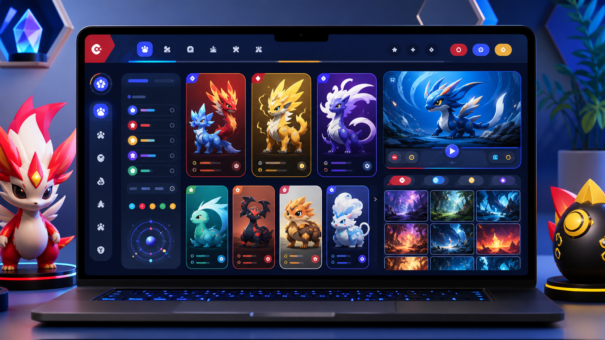

  
  
  

 
  
     
    
     
  

<h1 align="center">Poke GIFs</h1>

 <a href="#eye_speech_bubble-visualizar">Visualizar</a> •
 <a href="#information_source-sobre">Sobre</a> •
 <a href="#hammer_and_wrench-tecnologias">Tecnologias</a> • 
 <a href="#brain-conceitos-aplicados">Conceitos</a> •
 <a href="#sparkles-funcionalidades">Funcionalidades</a> •
 <a href="#label-palavras-chave">Palavras-chave</a> •
 <a href="#boy-autor">Autor</a> •
 <a href="#balance_scale-licença">Licença</a>

---

## :eye_speech_bubble: **Visualizar**

Preview visual do projeto:

<kbd></kbd>

  
---

## :information_source: _Sobre_

Projeto de estudo para navegação em uma galeria visual de criaturas e GIFs, com foco em listagem, filtros e experiência de descoberta.

---

## :hammer_and_wrench: _Tecnologias_

| :globe_with_meridians: Stack |
| :--------------------------: |
| GIF |
| Assets visuais |
| Organização de arquivos |

---

## :brain: _Conceitos Aplicados_

|  :page_facing_up:  |
| :----------------: |
| Catálogo visual |
| Organização de assets |
| Nomenclatura de arquivos |
| Conteúdo estático |

---

## :sparkles: _Funcionalidades_

|                     :page_facing_up:                      |
| :-------------------------------------------------------: |
| Apresentar galeria visual com cards e imagens animadas |
| Praticar organização de assets e navegação por conteúdo visual |

---

## :label: _Palavras-chave_

| :mag_right: Tags |
| :---------------: |
| `portfolio` |
| `joaovitorsw` |
| `pokedex` |
| `pokemon` |
| `api` |

---

## :boy: _Autor_

<a href="https://github.com/Joaovitorsw">
 
  
 <b>João Vitor Pereira dos Santos</b>
</a>

Desenvolvido com ❤️ por João Vitor Pereira dos Santos 👋🏽 Meus Contatos!

---

## :balance_scale: _Licença_

Copyright ©️ 2026 [João Vitor Pereira dos Santos](https://github.com/Joaovitorsw). 
Este projeto ainda não possui uma licença formal publicada.

